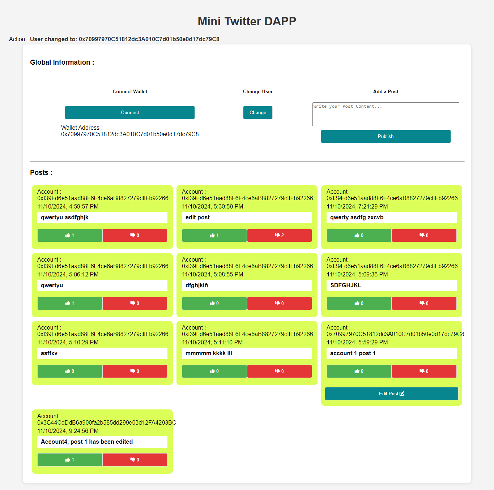

# Mini Twitter DApp

## Project Overview

The **Mini Twitter DApp** is a decentralized application that enables users to publish, like, dislike, and edit posts on a blockchain-based social media platform. Built on Ethereum using Web3.js, the DApp is designed to demonstrate how decentralized platforms operate by providing basic social media functionalities on the blockchain. Users connect their Ethereum wallets to authenticate and interact with posts, ensuring transparent and immutable interactions. The DApp prioritizes decentralization, user ownership, and secure, tamper-proof content storage.

## Key Features

- **Wallet Connection**: Users can connect their Ethereum wallet (e.g., MetaMask) to authenticate and interact with the DApp.
- **Publish Posts**: Users can create posts, which are stored immutably on the blockchain.
- **Post Interactions**: Users can like and dislike posts, with the reactions being securely tracked on the blockchain.
- **Edit Posts**: Users can edit posts they have authored, ensuring only the original creator can make changes.
- **Account Switching**: Users can switch between Ethereum accounts, allowing interactions from different wallet addresses.

## How It Works

1. **Smart Contract**: The core functionality, including post publishing, editing, and reactions, is implemented in a Solidity smart contract. The smart contract ensures that posts and user interactions are stored securely and remain immutable.
2. **Web3.js Integration**: The Web3.js library allows the DApp to interact with the Ethereum blockchain, enabling functions like wallet connection, transaction processing, and data retrieval.
3. **MetaMask Wallet**: Users authenticate by connecting their MetaMask wallet, which serves as their user ID and allows them to interact with the DApp securely.

## Prerequisites

- **MetaMask Wallet**: To connect to the DApp, users need MetaMask (or another Ethereum wallet).
- **Ethereum Test Network**: A test network Like Hardhat Network is recommended for deployment and testing to avoid mainnet fees.
- **Web3.js**: The DApp uses Web3.js for blockchain interactions.

## Usage Instructions

1. **Connect Wallet**: Click the "Connect Wallet" button to authenticate with MetaMask.
2. **Publish a Post**: Enter your message and click "Publish" to add your post to the blockchain.
3. **React to Posts**: Use the "Like" or "Dislike" buttons to react to posts.
4. **Edit Your Post**: If you authored a post, you can edit it directly from the UI.
5. **Switch Account**: Switch between accounts using MetaMask and select a different address for interactions.

## Challenges Addressed

- **User Feedback**: Clear status updates and error handling provide feedback on connection status, transaction processing, and any interaction errors.
- **Account Switching**: The DApp prompts users to select accounts directly from MetaMask to streamline user experience.
- **Transaction Delays**: Real-time user feedback is given during transaction processing, enhancing the app's responsiveness.

## Future Improvements

- **Additional Reactions**: Expanding interaction options beyond "like" and "dislike."
- **User Profiles**: Adding user profiles to enhance personalization.
- **Post Filtering**: Allowing users to filter posts by recent activity or popularity.
- **Dark Mode and UI Enhancements**: Improving the visual design and adding dark mode support.

## License

This project is open-source and available under the MIT License.
